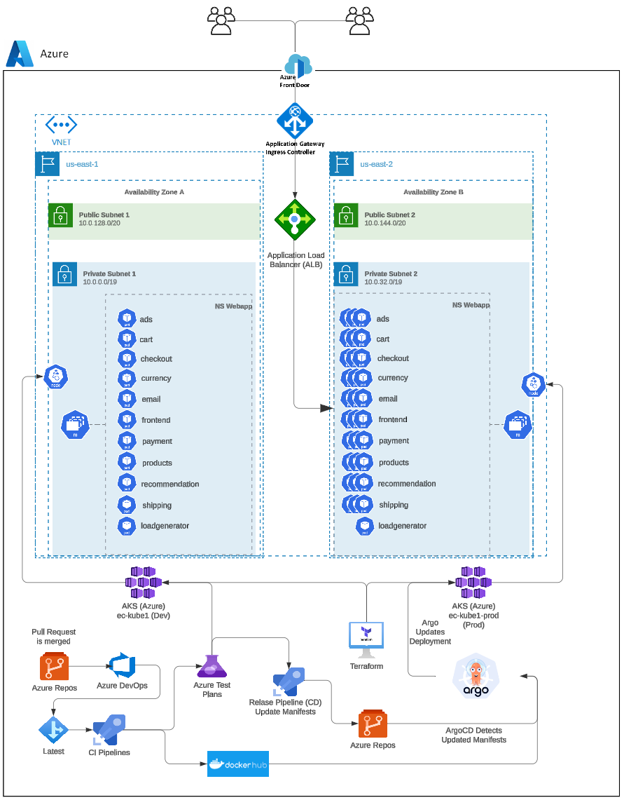
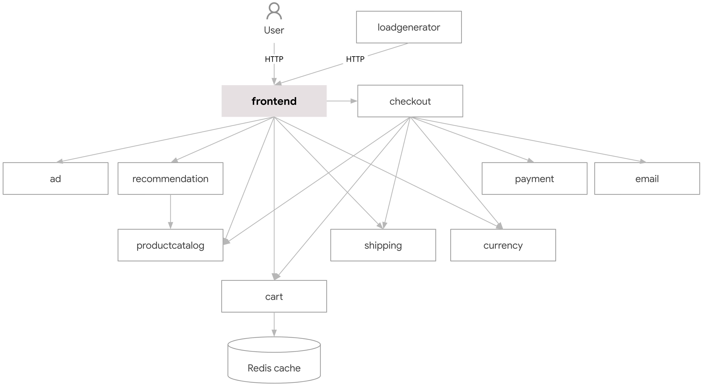
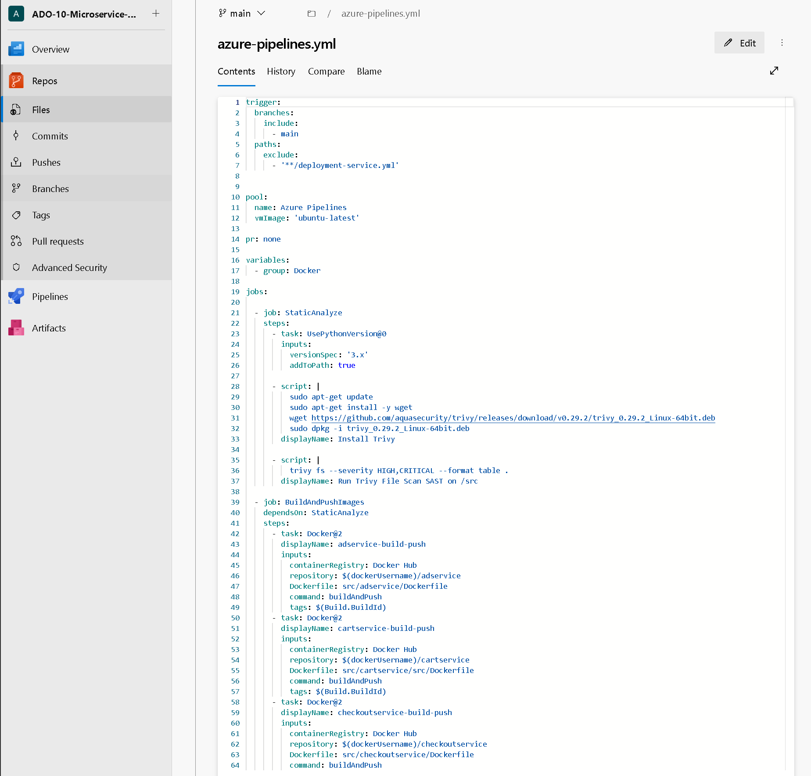
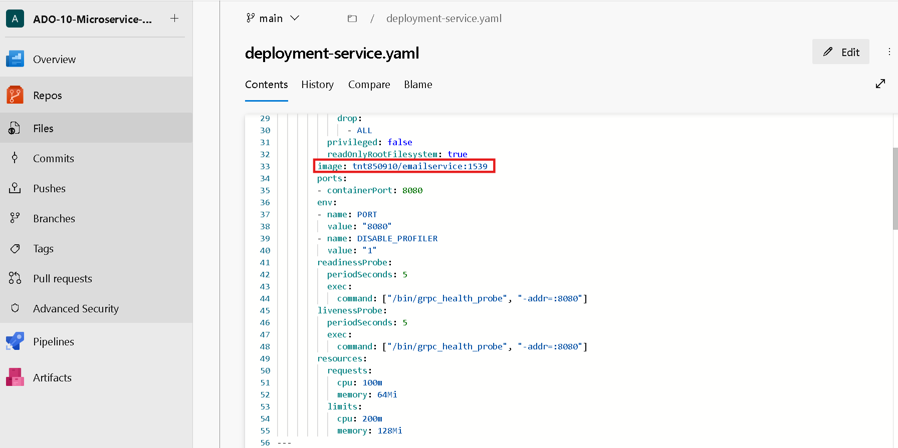
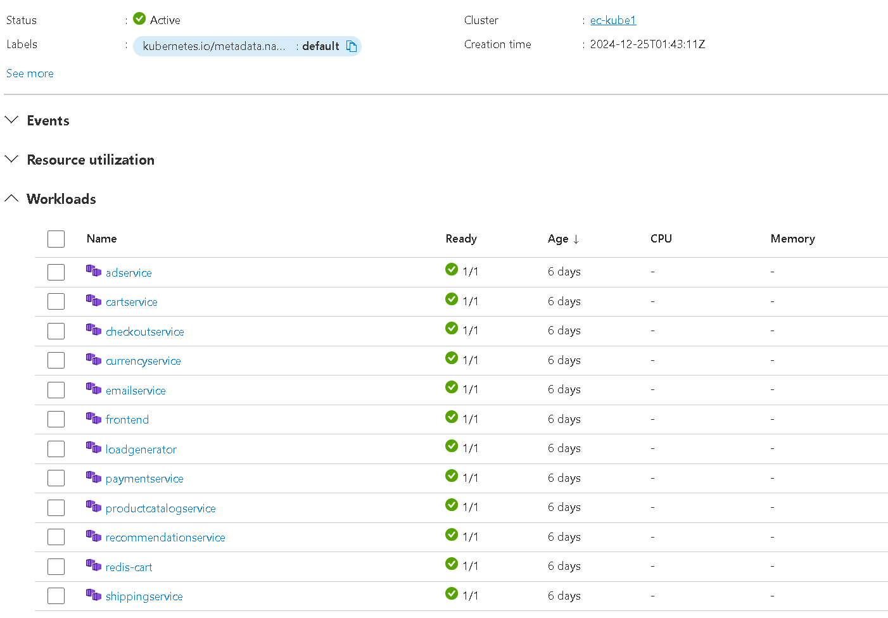
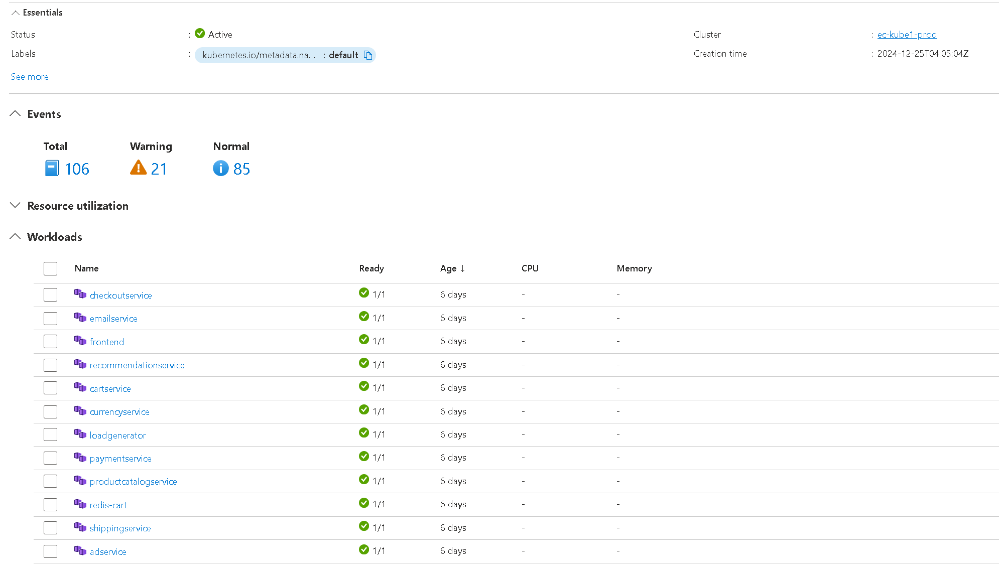
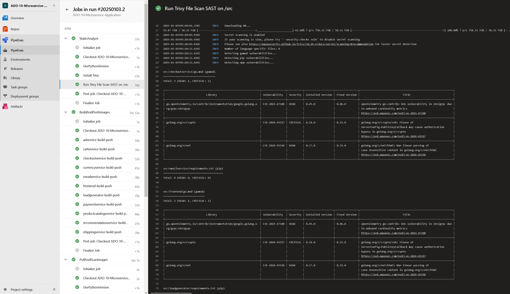
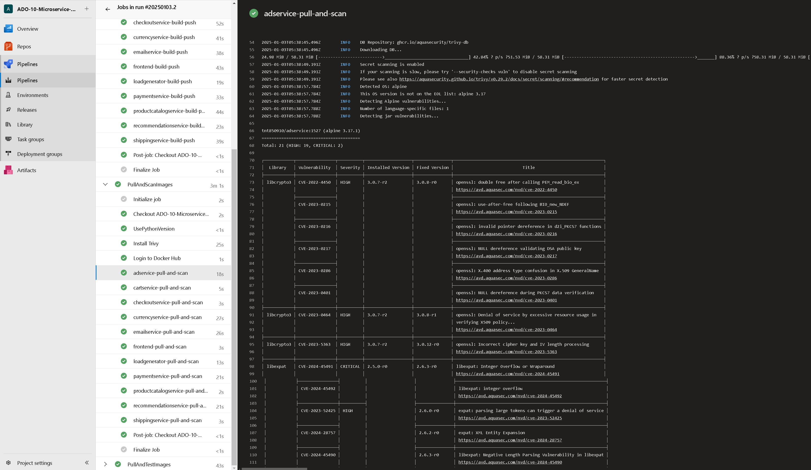

# AKS Microservices Delivery with Azure DevOps

An Azure DevOps delivery pipeline for
[Google Cloud's Online Boutique](https://github.com/GoogleCloudPlatform/microservices-demo),
a polyglot e-commerce application made of eleven gRPC services.

The repository adds an Azure delivery path around the upstream application:
source scanning, per-service container builds, image scanning, runtime tests,
manifest version updates, and separate AKS deployments.



## How the pipeline works

```text
source change
    │
    ▼
Trivy filesystem scan
    │
    ▼
build and publish 11 service images
    │
    ▼
pull and scan each image
    │
    ▼
run container health checks
    │
    ▼
update deployment-service.yaml with the build version
    │
    ▼
deploy to the selected AKS environment
```

[`azure-pipelines.yml`](azure-pipelines.yml) contains the build and scan jobs.
[`deployment-service.yaml`](deployment-service.yaml) defines the service
deployments, ports, probes, resource requests, and service-to-service addresses.

## Application services

| Service | Language | Responsibility |
| --- | --- | --- |
| `frontend` | Go | Browser-facing store and session handling |
| `cartservice` | C# | Redis-backed cart storage |
| `productcatalogservice` | Go | Product listing and search |
| `currencyservice` | Node.js | Currency conversion |
| `paymentservice` | Node.js | Mock payment processing |
| `shippingservice` | Go | Shipping estimates |
| `emailservice` | Python | Mock order-confirmation email |
| `checkoutservice` | Go | Checkout workflow orchestration |
| `recommendationservice` | Python | Product recommendations |
| `adservice` | Java | Contextual text ads |
| `loadgenerator` | Python/Locust | Synthetic browsing and checkout traffic |

[](docs/img/architecture-diagram.png)

The application code comes from Online Boutique. The Azure Pipeline,
environment promotion flow, image-version updates, and AKS integration are the
repository-specific work.

## Prerequisites

- an Azure DevOps project and pipeline;
- an Azure Container Registry or Docker Hub service connection;
- development and production AKS clusters;
- `kubectl` access to the target cluster; and
- Trivy available in the build agent, or permission for the pipeline to install it.

The pipeline expects an Azure DevOps variable group named `Docker` and a
container registry service connection named `Docker Hub`. Update those names
and the image repository values to match your environment.

Keep registry passwords and Azure credentials in variable groups or service
connections. Do not commit them to this repository.

## Local validation

Check that the pipeline and Kubernetes files are valid YAML:

```bash
python -m pip install pyyaml
python - <<'PY'
from pathlib import Path
import yaml

for path in (Path("azure-pipelines.yml"), Path("deployment-service.yaml")):
    list(yaml.safe_load_all(path.read_text()))
    print(f"ok: {path}")
PY
```

Service-specific tests live with each application under `src/<service>/` and
use that service's native toolchain. For example:

```bash
cd src/shippingservice
go test ./...
```

## Azure DevOps setup

1. Import or connect this repository to Azure Repos/Pipelines.
2. Create the container registry service connection.
3. Create the `Docker` variable group with `dockerUsername` and a secret
   `dockerPassword`.
4. Update the image repository names in `azure-pipelines.yml`.
5. Configure AKS service connections for the development and production
   environments.
6. Run the pipeline and review the Trivy results before promoting the generated
   image versions.

The manifest update job records the pipeline build ID in
`deployment-service.yaml`, giving each deployment an explicit set of service
versions.

## Deployment

Apply the generated manifest to a configured cluster:

```bash
az aks get-credentials --resource-group <resource-group> --name <cluster>
kubectl apply --dry-run=server -f deployment-service.yaml
kubectl apply -f deployment-service.yaml
kubectl rollout status deployment/frontend
kubectl get pods,svc
```

The frontend is exposed through a Kubernetes service; the remaining services
communicate over gRPC using the DNS names declared in the manifest.

## Screenshots

| Stage | Capture |
| --- | --- |
| Azure Pipeline |  |
| Manifest update |  |
| Development AKS |  |
| Production AKS |  |
| Trivy filesystem scan |  |
| Trivy image scan |  |

## License

Repository-specific pipeline, deployment, and documentation work is available
under the [MIT License](LICENSE). Online Boutique source files retain Google
LLC's Apache License 2.0 notices. See
[THIRD_PARTY_NOTICES.md](THIRD_PARTY_NOTICES.md).
