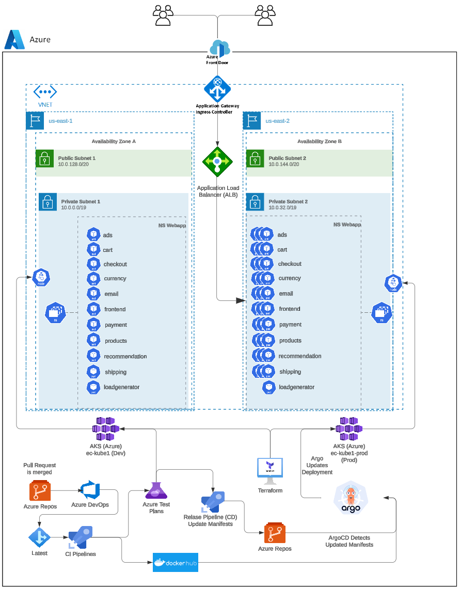
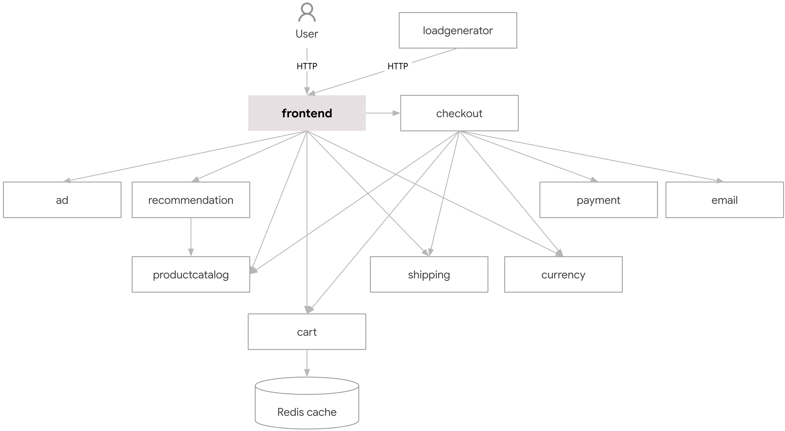
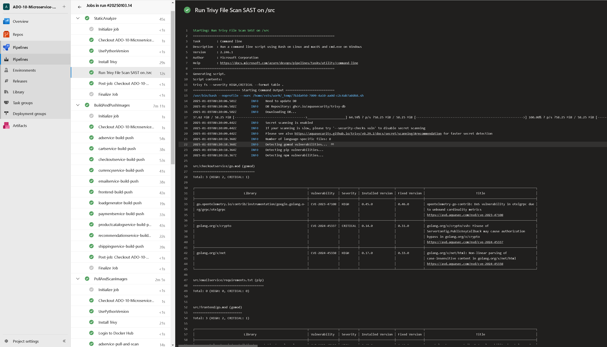
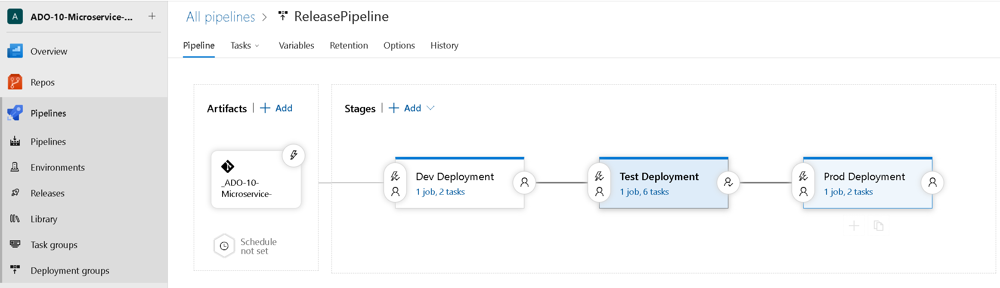
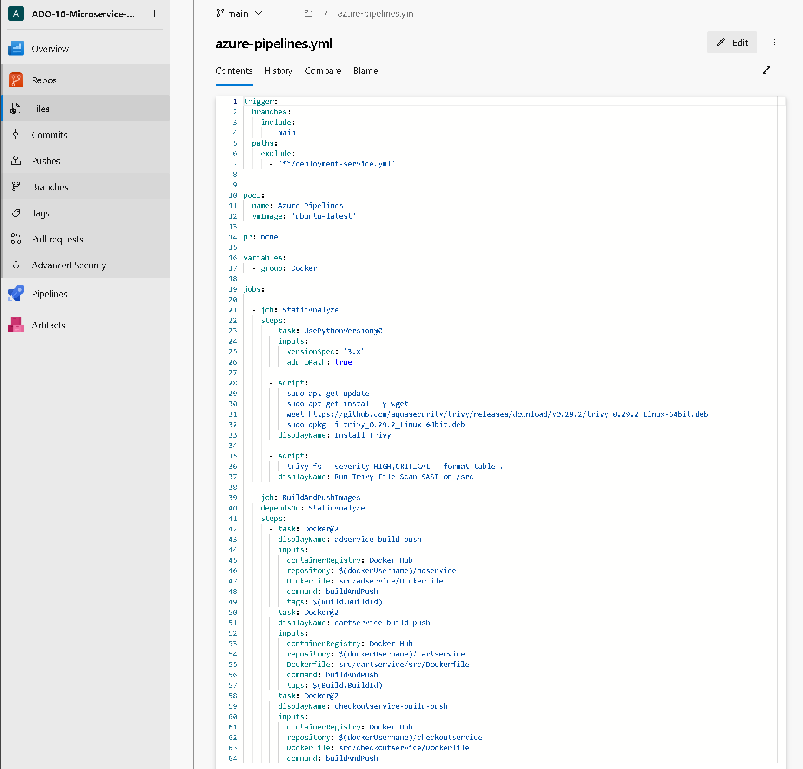
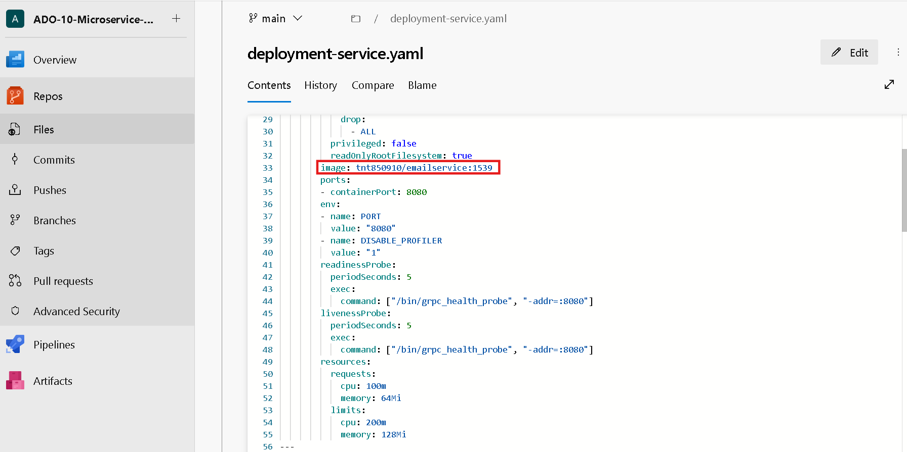
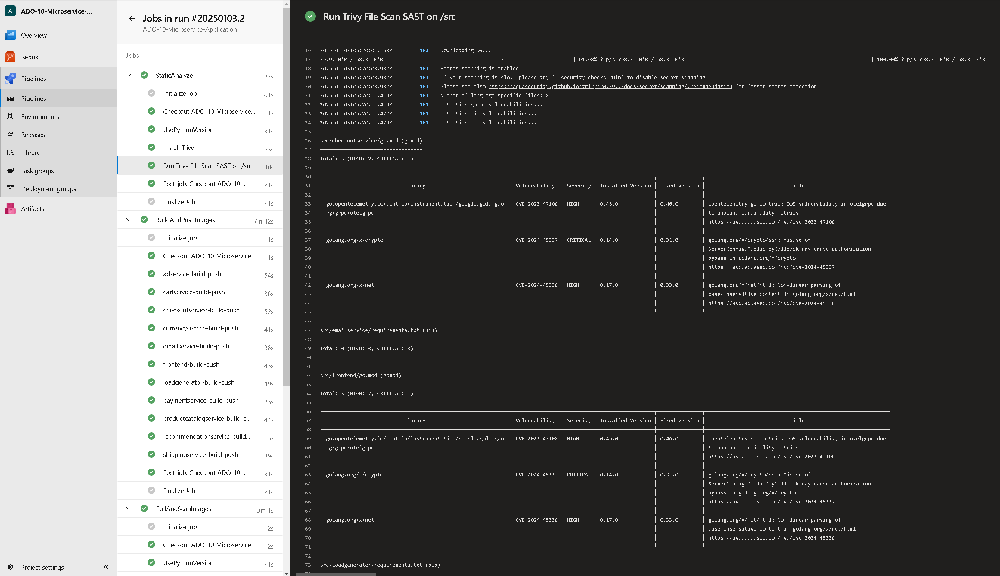
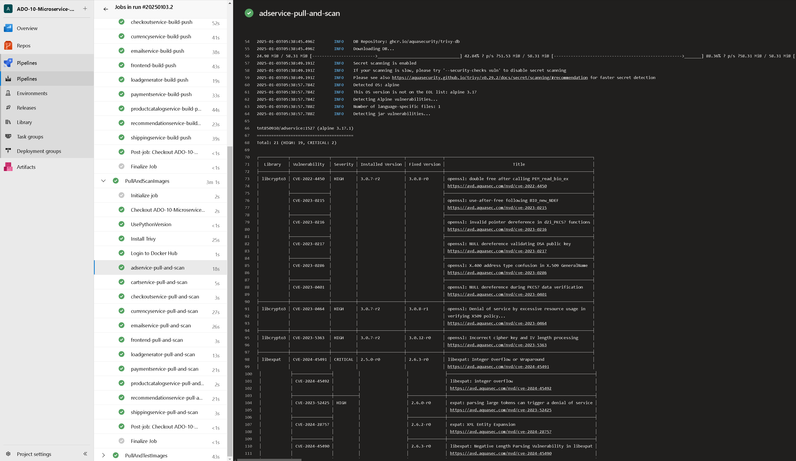
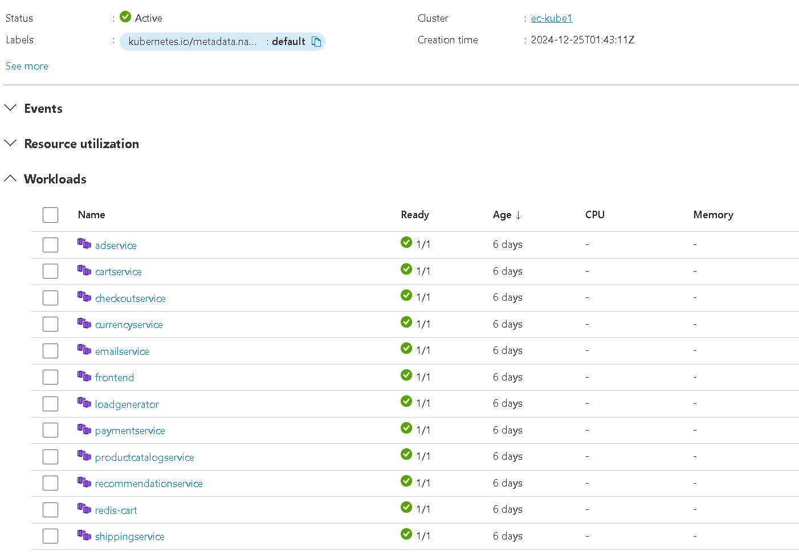
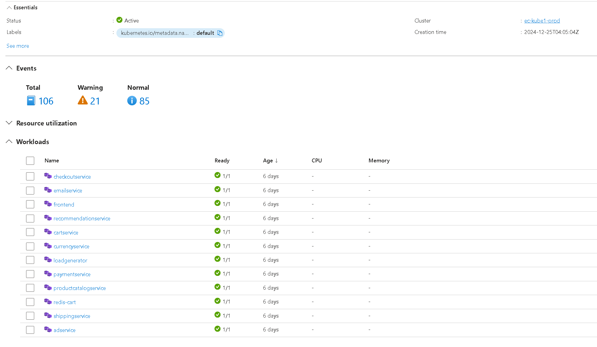

<div align="center">

# AKS Microservices Delivery with Azure DevOps

**Scan it, build it, pin it, ship it: an eleven-service storefront on Azure Kubernetes Service.**

An Azure DevOps pipeline and AKS manifest wrapped around Google Cloud's
[Online Boutique](https://github.com/GoogleCloudPlatform/microservices-demo),
a polyglot e-commerce app built from eleven gRPC services in Go, C#, Node.js,
Python and Java.

[](https://github.com/T-Py-T/aks-ado-microservices-cicd/actions/workflows/pr-checks.yml)

[Getting started](#getting-started) ·
[Worked path](#worked-path-validate-the-whole-delivery-offline) ·
[Pipeline](#how-the-pipeline-works) ·
[Deploy to AKS](#deploy-to-your-own-aks-cluster) ·
[Contributing](#contributing)


<sub>The storefront this pipeline delivers. Screenshot captured from an earlier deployment; nothing is hosted from this repository today.</sub>

</div>

## What you get

- **One pipeline file for the whole store.**
  [`azure-pipelines.yml`](azure-pipelines.yml) runs a Trivy filesystem scan,
  builds and pushes all eleven service images, pulls each one back for a Trivy
  image scan, then writes the build ID into the manifest.
- **One manifest for the whole cluster.**
  [`deployment-service.yaml`](deployment-service.yaml) declares 24 Kubernetes
  resources (deployments, services and Redis) with probes, resource requests
  and gRPC service addresses.
- **Manual on purpose.** `trigger: none` and `pr: none` mean nothing builds or
  publishes until someone starts the pipeline.
- **Pinned inputs.** Every external Docker parent image is pinned by digest,
  and the repository tests enforce it.
- **Checks you can run on a laptop.** Repository policy, manifest schema,
  Go/.NET unit tests and a Node service boot check all run without Azure.

## Getting started

### Prerequisites for local checks

- Python 3 and [`pre-commit`](https://pre-commit.com/)
- Go (the kubeconform module asks for Go 1.26 or newer; with the default
  `GOTOOLCHAIN=auto`, `go` downloads it)
- Optional, for the service checks: .NET 10 SDK, Node.js and npm

### Clone and check

```bash
git clone https://github.com/T-Py-T/aks-ado-microservices-cicd.git
cd aks-ado-microservices-cicd

pre-commit run --all-files
go run github.com/yannh/kubeconform/cmd/kubeconform@v0.8.0 -strict -summary deployment-service.yaml
```

Expected output:

```text
repository policy........................................................Passed
Summary: 24 resources found in 1 file - Valid: 24, Invalid: 0, Errors: 0, Skipped: 0
```

## Worked path: validate the whole delivery offline

This path follows what the pipeline checks without touching Azure.

**1. Repository policy.** Workflows run only on pull requests, Actions and
Docker parents are pinned, the Azure Pipeline has no automatic trigger, and
Redis is version- and digest-pinned:

```bash
pre-commit run --all-files
```

**2. Manifest schema.** Validate every resource in the AKS manifest offline:

```bash
go run github.com/yannh/kubeconform/cmd/kubeconform@v0.8.0 -strict -summary deployment-service.yaml
```

**3. Service tests.** Run the Go and .NET suites:

```bash
(cd src/productcatalogservice && go test ./...)
(cd src/shippingservice && go test ./...)
dotnet test src/cartservice/tests/cartservice.tests.csproj --configuration Release
```

**4. Boot a service.** Install the currency service and confirm its gRPC server
starts:

```bash
(cd src/currencyservice && npm ci)
node tests/node_service_smoke.js src/currencyservice server.js "CurrencyService gRPC server started" 17000
```

The smoke script starts the server, waits for the ready message, stops it, and
exits 0 when the server came up.

**The rest of the pull-request gate** (not run for this README). CI also runs
these:

```bash
for service in checkoutservice frontend; do
  (cd "src/$service" && go test ./...)
done
(cd src/currencyservice && npm audit --omit=dev)
(cd src/paymentservice && npm ci && npm audit --omit=dev)
node tests/node_service_smoke.js src/paymentservice index.js "PaymentService gRPC server started" 15000
python -m pip install pip-audit
pip-audit -r src/emailservice/requirements.txt
pip-audit -r src/recommendationservice/requirements.txt
pip-audit -r src/loadgenerator/requirements.txt
(cd src/adservice && ./gradlew --no-daemon build)   # needs Java 25
```

Grype exceptions in [`.grype.yaml`](.grype.yaml) cover only advisories whose
fixes need a prerelease runtime.

## How the pipeline works

```text
manual run
    │
    ▼
StaticAnalyze             Trivy filesystem scan (HIGH/CRITICAL fails the run)
    │
    ▼
BuildAndPushImages        11 × Docker@2 build and push
    │
    ▼
PullAndScanImages         pull each image back, Trivy image scan
    │
    ▼
UpdateAndCommitDeploymentYAML
                          write the build ID into deployment-service.yaml
    │
    ▼
review the manifest, then apply it to AKS (operator step)
```

Each run commits its build ID to `deployment-service.yaml`, so a deployment
names an explicit set of service versions. That write-back is the reason
automatic triggers are off.



The diagram shows the wider target design. Some parts of it, including
Terraform, Argo CD, Front Door and Application Gateway, have no configuration
in this repository. What is in the tree is the pipeline YAML and the manifest.

## Application services

| Service | Language | Responsibility |
| --- | --- | --- |
| `frontend` | Go | Browser-facing store and session handling |
| `cartservice` | C# | Redis-backed cart storage |
| `productcatalogservice` | Go | Product listing and search |
| `currencyservice` | Node.js | Currency conversion |
| `paymentservice` | Node.js | Mock payment processing |
| `shippingservice` | Go | Shipping estimates |
| `emailservice` | Python | Mock order-confirmation email |
| `checkoutservice` | Go | Checkout workflow orchestration |
| `recommendationservice` | Python | Product recommendations |
| `adservice` | Java | Contextual text ads |
| `loadgenerator` | Python/Locust | Synthetic browsing and checkout traffic |

[](docs/img/architecture-diagram.png)

The application code comes from Online Boutique. This repository adds the
Azure Pipeline, the image-version write-back and the AKS manifest.

## Run it in your own Azure DevOps project

None of these steps were run for this README. The repository contains no
Azure credentials, registry, or cluster, and it does not claim that any
pipeline or cluster is running now.

You need:

- an Azure DevOps project and pipeline;
- a container registry service connection (the pipeline is wired to one
  named `Docker Hub`);
- a variable group named `Docker` with `dockerUsername` and a secret
  `dockerPassword`;
- an AKS cluster and `kubectl` access to it; and
- a build agent that can install Trivy (the pipeline downloads it and checks
  its checksum).

Then:

1. Import or connect this repository to Azure Repos/Pipelines.
2. Create the registry service connection and the `Docker` variable group.
3. Update the image repository names in `azure-pipelines.yml` if needed.
4. Start the pipeline manually and review the Trivy results.
5. Review the manifest change the pipeline commits.

Keep registry passwords and Azure credentials in variable groups or service
connections, never in the repository.

## Deploy to your own AKS cluster

Not run for this README; this needs your own cluster and credentials:

```bash
az aks get-credentials --resource-group <resource-group> --name <cluster>
kubectl apply --dry-run=server -f deployment-service.yaml
kubectl apply -f deployment-service.yaml
kubectl rollout status deployment/frontend
kubectl get pods,svc
```

A Kubernetes service exposes the frontend. The other services talk to each
other over gRPC using the DNS names in the manifest.

## Gallery

These are historical captures from an earlier run of this delivery path (the
CI run shown is dated January 2025). They show what the stages looked like
then; they are not evidence that anything is running today.

| Stage | Capture |
| --- | --- |
| CI pipelines |  |
| Release pipeline (dev → test → prod) |  |
| Pipeline run |  |
| Manifest update |  |
| Trivy filesystem scan |  |
| Trivy image scan |  |
| Development AKS |  |
| Production AKS |  |
| Storefront cart and checkout |  |

The release pipeline was configured in the Azure DevOps UI and has no YAML in
this repository. Terraform plan/apply captures are also in
[`docs/img/`](docs/img), but no Terraform configuration is in the tree.

## Roadmap and open problems

Planned work is in [ROADMAP.md](ROADMAP.md). Known gaps and held decisions are
in [docs/OPEN_PROBLEMS.md](docs/OPEN_PROBLEMS.md).

## Contributing

Good first areas: pipeline hardening, manifest improvements, more offline
checks, or clearer setup docs.

1. Fork the repository and branch from `main`.
2. Keep one concern per pull request and say which pipeline stage, service or
   Kubernetes resource it touches.
3. Run `pre-commit run --all-files` and the kubeconform check, plus the tests
   for any service you change.
4. Never commit credentials, registry passwords or generated images.
5. Open a pull request against `main`. The PR Checks workflow is the merge
   gate.

See [CONTRIBUTING.md](CONTRIBUTING.md) for details. Please report
vulnerabilities privately as described in [SECURITY.md](SECURITY.md).

## License

Repository-specific pipeline, deployment and documentation work is available
under the [MIT License](LICENSE). The Online Boutique source files keep Google
LLC's Apache License 2.0 notices. See
[THIRD_PARTY_NOTICES.md](THIRD_PARTY_NOTICES.md) and [NOTICE.md](NOTICE.md).

## Acknowledgements

- [Online Boutique](https://github.com/GoogleCloudPlatform/microservices-demo)
  by Google Cloud, the application this pipeline delivers
- [Trivy](https://github.com/aquasecurity/trivy) and
  [kubeconform](https://github.com/yannh/kubeconform)
