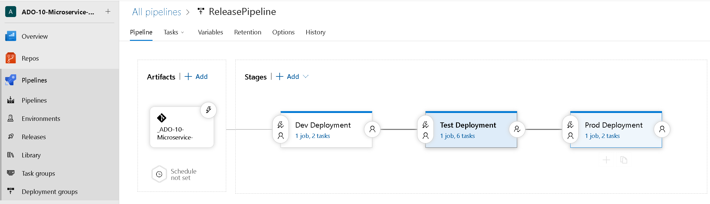
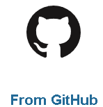
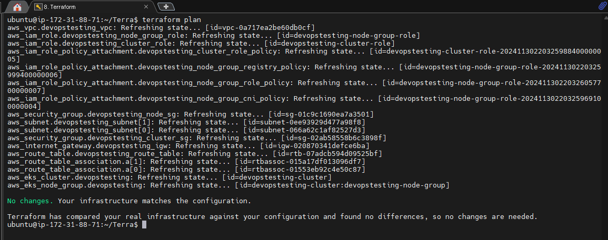

# Azure Devops/Kubernetes microservice CI/CD

> This project is a simple java web app that allows users to post their thoughts and blog digitally. Its mostly used to prove that scanning and other CI pipeline items are working.

This DevOps project employs a comprehensive CI pipeline to automate the development and deployment process. The architecture emphasizes security, performance, and reliability, integrating industry-leading tools and practices.

### My DevOps Scripting Examples

- My current examples of this project are located here:
  - This included Terraform, Bash scripts and other scripting
  - https://github.com/T-Py-T/devops-install-scripts

## Application overview

[Online Boutique](https://github.com/GoogleCloudPlatform/microservices-demo) is a cloud-first microservices demo application consisting of 11 microservices applications. The application is a web-based e-commerce app where users can browse items, add them to the cart, and purchase them.

### Screenshots

| Home Page | Checkout Screen |
| ------- | ----- |
| [](/docs/img/online-boutique-frontend-1.png) | [](/docs/img/online-boutique-frontend-2.png) |

### Application Architecture

Each of the 11 microservices written in different languages that talk to each other over gRPC.

[](/docs/img/architecture-diagram.png)

Find **Protocol Buffers Descriptions** at the [`./protos` directory](/protos).

| Service | Language |   Description     |
| -------| --------| -------- |
| [frontend](/src/frontend) | Go    | Exposes an HTTP server to serve the website. Does not require signup/login and generates session IDs for all users automatically. |
| [cartservice](/src/cartservice) | C#  | Stores the items in the user's shopping cart in Redis and retrieves it.   |
| [productcatalogservice](/src/productcatalogservice) | Go   | Provides the list of products from a JSON file and ability to search products and get individual products.  |
| [currencyservice](/src/currencyservice) | Node.js   | Converts one money amount to another currency. Uses real values fetched from European Central Bank. It's the highest QPS service. |
| [paymentservice](/src/paymentservice)  | Node.js       | Charges the given credit card info (mock) with the given amount and returns a transaction ID.                                     |
| [shippingservice](/src/shippingservice)             | Go            | Gives shipping cost estimates based on the shopping cart. Ships items to the given address (mock)                                 |
| [emailservice](/src/emailservice)                   | Python        | Sends users an order confirmation email (mock).                                                                                   |
| [checkoutservice](/src/checkoutservice)             | Go            | Retrieves user cart, prepares order and orchestrates the payment, shipping and the email notification.                            |
| [recommendationservice](/src/recommendationservice) | Python        | Recommends other products based on what's given in the cart.                                                                      |
| [adservice](/src/adservice)                         | Java          | Provides text ads based on given context words.                                                                                   |
| [loadgenerator](/src/loadgenerator)                 | Python/Locust | Continuously sends requests imitating realistic user shopping flows to the frontend.     |

## Features

- **[Kubernetes](https://kubernetes.io)/[AKS](https://azure.microsoft.com/en-us/products/kubernetes-service):**
  The app is designed to run on Kubernetes (both locally on "Docker for
  Desktop", as well as on the cloud with AKS).
- **[gRPC](https://grpc.io):** Microservices use a high volume of gRPC calls to
  communicate to each other.

- **[Skaffold](https://skaffold.dev):** Application
  is deployed to Kubernetes with a single command using Skaffold.
- **Synthetic Load Generation:** The application demo comes with a background
  job that creates realistic usage patterns on the website using
  [Locust](https://locust.io/) load generator.
  
  
> # Note: This is a reminder to come back and update this section.
- [ ] Add screenshots of monitoring dashboards
- [ ] Describe log aggregation strategy

## Best Practices Followed

1. **Automation**: The build, test, and deployment process is automated, reducing the risk of human error and speeding up the cycle times. Automation ensures that every code change is tested and validated before deployment.
2. **Security First**: Integrating Aqua Trivy and SonarQube ensures that security vulnerabilities and code quality issues are detected and addressed early in the pipeline, fostering a secure development lifecycle.
3. **Scalability**: Kubernetes provides a scalable infrastructure that can handle fluctuating loads, ensuring consistent performance during peak traffic.
4. **Observability**: Using Grafana and Prometheus allows real-time monitoring, enabling proactive identification and resolution of potential issues before they impact users.
5. **Version Control and Code Review**: GitHub serves as the foundation for collaboration and quality control, ensuring that only well-reviewed, high-quality code reaches production.

## Architecture

The CI/CD pipeline is depicted in the diagram below, which mirrors the "as-built" system, showcasing the tools and workflows utilized.


### Key Components

#### A. **Source Code Management**

- **GitHub**:
  - Serves as the backbone of version control, ensuring seamless collaboration among team members.
  - Pull requests and branch strategies help enforce coding standards and encourage peer reviews.
  - Integrated with Jenkins to trigger automated builds and tests upon code commits, ensuring continuous integration.
  - Setup with the Azure Devops Project with connection to the git repository

#### B. **Build and Test Automation**

- **Azure DevOps**:
  - Orchestrates the CI/CD pipeline, ensuring that builds, tests, and deployments are fully automated.
  - Integrates with tools like GitHub and Docker to create a streamlined process from code commit to deployment.
  - Provides real-time feedback to developers about build status and test results.

  **CI Pipelines**
  

  **Release Pipelines**
  

  **Dev AKS Deplyoment**
  

  **Prod AKS Deplyoment**
  


- **Azure DevOps -TODO**:
  - Relies on external Terraform setup for environment to work
    - When cluster is built API changes
    - Permissions for Jenkins need to be created with cluster (kubectl)
  - Call Terraform in pipeline
    - Allow for tear down of resources after load testing is completed.
    - Pipeline created cluster can be used for load or AB testing.

#### C. **Security Scanning**

- **Aqua Trivy**:
  - Scans Docker docs/img and source code for vulnerabilities, ensuring that potential security issues are caught before deployment.
  - Generates detailed reports that can be used to address vulnerabilities promptly.

  

- **SonarQube**:
  - Conducts comprehensive code analysis to identify bugs, code smells, and security vulnerabilities.
  - Provides actionable insights to improve code quality and enforce compliance with coding standards.

  

#### D. **Containerization**

- **Docker**:
  - Packages the Java application into lightweight, portable containers, ensuring consistent environments across development, testing, and production stages.
  - Simplifies deployment by abstracting underlying infrastructure differences.

  *Callout Area*: Showcase Dockerfile and container registry management, explaining how this enables rapid, reliable deployments.

#### E. **Container Orchestration**

- **Azure Kubernetes Service (AKS)**:
  - Manages the deployment and scaling of containerized applications in a highly available environment.
  - Ensures zero downtime by automatically scaling and redistributing workloads as needed.
  - Namespace configurations (e.g., `webapps` and `namespace 2`) isolate different parts of the system for better organization and security. The second namespace is not currently used, but is planned for a similar python web app
  - The configuration for AKS was update from the **terraform.tf** listed in the linked repo and shown implemented below in a later section.

- **AKS Nodes**
  

- **AKS CLuster**
  

- **AKS Networking**
  


<!-- REMOVE WHEN READY IF REQUIRED

## Deploy Online Boutique to the cluster
This is run during the deployment (CD) pipeline that is contigent on a successful CI pipeline completion

   ```sh
   kubectl apply -f ./release/kubernetes-manifests.yaml
   ```

### Wait for the pods to be ready.

   ```sh
   kubectl get pods
   ```

   After a few minutes, you should see the Pods in a `Running` state:

   ``` tty
   NAME                                     READY   STATUS    RESTARTS   AGE
   adservice-76bdd69666-ckc5j               1/1     Running   0          2m58s
   cartservice-66d497c6b7-dp5jr             1/1     Running   0          2m59s
   checkoutservice-666c784bd6-4jd22         1/1     Running   0          3m1s
   currencyservice-5d5d496984-4jmd7         1/1     Running   0          2m59s
   emailservice-667457d9d6-75jcq            1/1     Running   0          3m2s
   frontend-6b8d69b9fb-wjqdg                1/1     Running   0          3m1s
   loadgenerator-665b5cd444-gwqdq           1/1     Running   0          3m
   paymentservice-68596d6dd6-bf6bv          1/1     Running   0          3m
   productcatalogservice-557d474574-888kr   1/1     Running   0          3m
   recommendationservice-69c56b74d4-7z8r5   1/1     Running   0          3m1s
   redis-cart-5f59546cdd-5jnqf              1/1     Running   0          2m58s
   shippingservice-6ccc89f8fd-v686r         1/1     Running   0          2m58s
   ```

### Access the web frontend in a browser using the frontend's external IP.

   ```sh
   kubectl get service frontend-external | awk '{print $4}'
   ```

   Visit `http://EXTERNAL_IP` in a web browser to access your instance of Online Boutique.

### Once you are done with it, delete the AKS cluster.
-->

  
#### F. **Monitoring and Observability**

- **Prometheus**:
  - Collects metrics from various components of the application and infrastructure, providing deep insights into system health and performance.
  - Supports custom queries to detect anomalies and trigger alerts proactively.
  

- **Grafana**:
  - Provides user-friendly dashboards for visualizing Prometheus metrics.
  - Enables stakeholders to monitor key performance indicators (KPIs) in real-time, ensuring system reliability.
  

  *Callout Area*: Include snapshots of Grafana dashboards and Prometheus query outputs, demonstrating the observability aspect of the pipeline.

<!-- Removed Until IaC is added to the project

#### G. **Infrastructure as Code (IaC)**

- **Terraform**:
  - Automates the provisioning and management of infrastructure required for the Kubernetes stack that hosts the Java application.
  - Ensures infrastructure consistency and repeatability by defining it as code.
  - The following key AWS resources are provisioned:
    - **VPC**: Creates a virtual private cloud for network isolation.
    - **Subnets**: Two public subnets in `us-east-1a` and `us-east-1b` availability zones.
    - **Internet Gateway**: Provides internet access to the resources within the VPC.
    - **Route Tables and Associations**: Configures routing for the subnets to allow public internet access.
    - **Security Groups**: Defines rules for cluster and node communication, ensuring controlled ingress and egress.
    - **AKS Cluster**: Deploys an Azure Kubernetes Service cluster for managing the application containers.
    - **AKS Node Group**: Provisions a scalable worker node group with `t2.large` instances to support container workloads.
    - **IAM Roles and Policies**: Configures roles and permissions for both the AKS cluster and node group to interact with AWS services.
  - Facilitates rapid updates and scaling of infrastructure to match application requirements.

``` bash
terraform plan
```



``` bash
terraform apply --auto-approve
```


 
-->